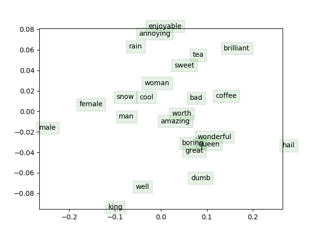

## 1a

Because the true empirical distribution $\boldsymbol{y}$ is a one-hot vector, for any word $w=o$, only $y_o$ equals $1$ and others equals $0$. So, cross-entropy loss is the same as the naive-softmax loss.
$$
\begin{aligned}
- \sum_{w\in Vocab}y_w\log(\hat{y}_w) &= - [y_1\log(\hat{y}_1) + \cdots + y_o\log(\hat{y}_o) + \cdots + y_w\log(\hat{y}_w)] \\
& = - y_o\log(\hat{y}_o) \\
& = -\log(\hat{y}_o) \\
& = -\log \mathrm{P}(O = o | C = c) 
\end{aligned}
$$

## 1b

先把loss按照cross entropy展开
$$
\because 
J_\mathrm{naive-softmax} = CE(y, \hat{y}) = -\log(\hat{y}_o) \\
\hat{y}_o = \mathrm{softmax}(\theta) = {\exp(\theta_o) \over \sum_j \exp(\theta_j) }\\
\therefore 
J = -\log  {\exp(\theta_o) \over \sum_j \exp(\theta_j) } = -\theta_o + \log \sum_j \exp(\theta_j)
$$
然后求偏导数
$$
\frac{\partial J}{\partial \theta} = -\frac{\partial \theta_o}{\partial\theta} + \frac{\partial\log\sum_j\exp(\theta_j)}{\partial\theta}
$$
对第一部分，对向量求导即对向量内元素分别求导，维度不变。
$$
\frac{\partial\theta_o}{\partial\theta} =y
$$
其中，$\frac{\partial\theta_o}{\partial\theta_o}=1$，其他情况 $j\neq o$ 时 $\frac{\partial\theta_o}{\partial\theta_j}=1$，即 $y=\{0 \cdots y_o \cdots 0\}$。

对第二部分，应用chain rule，同样对向量内元素分别求导。
$$
\begin{aligned}
\frac{\partial{\log(\sum_j{e^{\theta_j})}}}{\partial{\theta_i}}
    &= \frac{\partial{\log(\sum_j{e^{\theta_j})}}} {\sum_j{e^{\theta_j}}} \cdot \frac{\sum_j{e^{\theta_j}}}{\partial{\theta_i}}  \\
    &= \frac{1}{\sum_j{e^{\theta_j}}} \cdot e^{\theta_i}  \\
    &= \frac{e^{\theta_i}}{\sum_j{e^{\theta_j}}}  \\
    &= \hat{y}_i  
\end{aligned}
$$
把两部分合在一起：
$$
\frac{\partial J}{\partial \theta}=- \frac{\theta_o}{\partial\theta} + \frac{\partial\log\sum_j{e^{\theta_j}} }{\partial\theta} = -y + \hat{y}
$$
然后，loss对$v_c$求偏导，应用chain rule：
$$
\begin{aligned}
\frac{\partial J}{\partial v_c} &= \frac{\partial J}{\partial \theta} \frac{\partial \theta}{\partial v_c} \\
&= (\hat{y} - y) \frac{\partial U^T v_c}{\partial v_c} \\
&= (\hat{y} - y)U
\end{aligned}
$$
其中，$U\in R^{|V|\times d}$ 包括所有的outside vector $u_w$。所以， $\frac{\partial J}{\partial v_c} \in R^d$。

## 1c

类似上面的求解方法
$$
\begin{aligned} 
\frac{\partial J}{\partial u_w} &= \frac{\partial J}{\partial \theta} \frac{\partial \theta}{\partial U} \\
&= (\hat{y} - y) \frac{\partial U^Tv_c}{\partial U} \\
&= (\hat{y} - y) v_c
\end{aligned}
$$
所以，$\frac{\partial J}{\partial U}\in R^{|V|\times d}$ 。

## 1d

已知 $\exp(x)' = \exp(x)$，应用chain rule，令$f=\exp(-x)$
$$
\begin{aligned}
\frac{d}{dx}\sigma(x) &= \frac{d\sigma(x)}{df} \frac{df}{dx} \\
&=-(1+\exp(-x))^{-2} \cdot -\exp(-x) \\
&=\frac1{1+\exp(-x)}\cdot \frac1{1+\exp(-x)} \exp(-x) \\
&=\sigma(x) \cdot \sigma(-x)
\end{aligned}
$$
如果$x$是vector的话
$$
\begin{aligned}
\frac{\partial \sigma(x)}{\partial x}
&= \left[\frac{\partial \sigma\left(x_{j}\right)}{\partial x_{i}}\right]_{d \times d}
\\ &=\left[\begin{array}{cccc}{\sigma^{\prime}\left(x_{1}\right)} & {0} & {\cdots} & {0} \\ {0} & {\sigma^{\prime}\left(x_{2}\right)} & {\cdots} & {0} \\ {\vdots} & {\vdots} & {\vdots} & {\vdots} \\ {0} & {0} & {\cdots} & {\sigma^{\prime}\left(x_{d}\right)}\end{array}\right]
\\ &=\text{diag}(\sigma^\prime(x))
\end{aligned}
$$


## 1e

$$
J_\mathrm{neg-sample} = -\log(\sigma(u_o^T v_c)) - \sum_{k=1}^K \log(\sigma(-u_k^T v_c))
$$

对 $v_c$ 求偏导数


$$
\begin{aligned}
\frac{\partial J}{\partial v_c} &= -\frac1{\sigma(u_o^T v_c)}\cdot \frac{\partial \sigma(u_o^T v_c)}{\partial v_c} - \sum_{k=1}^K \frac1{\sigma(-u_k^T v_c)} \cdot \frac{\partial \sigma(-u_k^T v_c)}{\partial v_c} \\
&= -\frac1{\sigma(u_o^T v_c)}\cdot \sigma(u_o^T v_c)\sigma(-u_o^T v_c)\cdot \frac{\partial u_o^T v_c}{\partial v_c} - \sum_{k=1}^K \frac1{\sigma(-u_k^T v_c)} \cdot \sigma(-u_k^T v_c)\sigma(u_k^T v_c) \cdot \frac{\partial -u_k^T v_c}{\partial v_c} \\
&= - \sigma(-u_o^T v_c) u_o^T - \sum_{k=1}^K \sigma(u_k^T v_c)(-u_k^T) \\
&=(\sigma(u_o^T v_c)-1) u_o^T + \sum_{k=1}^K \sigma(u_k^T v_c)u_k^T \\
\end{aligned}
$$
对$u_o$求偏导数
$$
\begin{aligned}
\frac{\partial J}{\partial u_o} &= - \frac1{\sigma(u_o^T v_c)}\cdot \frac{\partial \sigma(u_o^T v_c)}{\partial u_o} \\
&=- \frac1{\sigma(u_o^T v_c)}\cdot \sigma(u_o^T v_c)\sigma(-u_o^T v_c) \cdot \frac{\partial u_o^T v_c}{\partial v_c} \\
&= (\sigma(u_o^T v_c) -1)v_c
\end{aligned}
$$
对$u_k$求偏导数
$$
\begin{aligned}
\frac{\partial J}{\partial u_k} &= - \sum_{k=1}^K \frac1{\sigma(-u_k^T v_c)} \cdot \frac{\partial \sigma(-u_k^T v_c)}{\partial u_k} \\
&= \frac1{\sigma(-u_k^T v_c)} \cdot \sigma(-u_k^T v_c) \sigma(u_k^T v_c) \cdot \frac{\partial -u_k^T v_c}{\partial u_k} \\
&= \sigma(u_k^T v_c) v_c
\end{aligned}
$$
可以看出naive softmax对$v_c$求偏导的时候，
$$
\frac{\partial J}{\partial v_c} = U (\hat{y} - y)
$$
需要与output vector矩阵运算，复杂度是和词表$V$大小相关的；

而negative sampling的三个求偏导步骤没有这个问题，仅和负样本数量$K$相关。

##1f

$$
\begin{aligned}
\frac{\partial J_\mathrm{skip-gram}}{\partial U} &= \sum_{-m\leq j\leq m\atop j\neq 0} \frac{\partial J(v_c, w_{t+j}, U)}{\partial U} \\
\frac{\partial J_\mathrm{skip-gram}}{\partial v_c} &= \sum_{-m\leq j\leq m\atop j\neq 0} \frac{\partial J(v_c, w_{t+j}, U)}{\partial v_c} \\
\frac{\partial J_\mathrm{skip-gram}}{\partial v_w} &= 0
\end{aligned}
$$

## 2e

```
iter 39980: 6.869433
iter 39990: 6.856858
iter 40000: 6.836423
sanity check: cost at convergence should be around or below 10
training took 10327 seconds
```



结果看起来还可以

- 对同义词任务来说，因为context的原因，某些同义词或反义词是在一起，比如enjoyable/annoying, bad/worth/amazing/wonderful/boring/great
- 对类比任务来说，man:king::woman:queen 和 male:king::female:queue基本是平行的，还算符合预期
