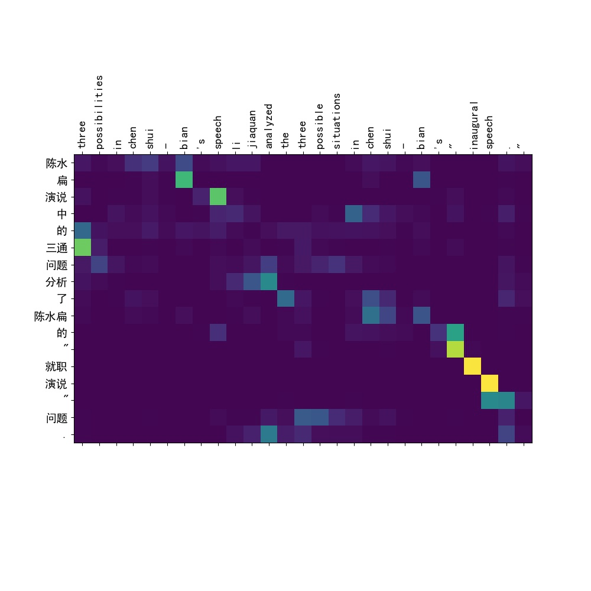
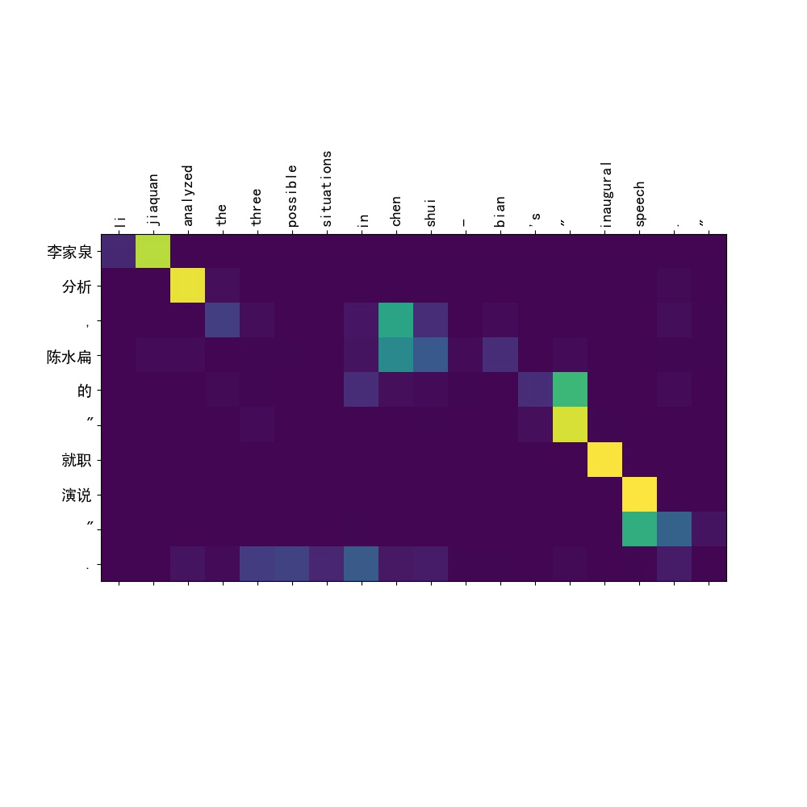

# NMT Assignment
Note: Heavily inspired by the https://github.com/pcyin/pytorch_nmt repository


## 1g
Masks let padding words' attention scores be zero, that will not disturb softmax results, and always take no effect when source words align to target ones.

If we don't apply mask operation, decoder will use the hidden state of padding words, which should actually not be existed. It might lead to unexpected condition.

## 1i
es->en BLEU: 22.66600148593284

> epoch 13, iter 84000, avg. loss 28.74, avg. ppl 5.04 cum. examples 64000, speed 2908.06 words/sec, time elapsed 16358.19 sec
> epoch 13, iter 84000, cum. loss 29.57, cum. ppl 5.33 cum. examples 64000
> begin validation ...
> validation: iter 84000, dev. ppl 17.075152
> hit patience 5
> hit #5 trial
> early stop!

ch->en BLEU: 23.23073252712383

> epoch 27, iter 80000, avg. loss 46.84, avg. ppl 4.03 cum. examples 64000, speed 6374.08 words/sec, time elapsed 13902.54 sec
> epoch 27, iter 80000, cum. loss 47.70, cum. ppl 4.09 cum. examples 64000
> begin validation ...
> validation: iter 80000, dev. ppl 11.621563
> hit patience 5
> hit #5 trial
> early stop!

en->ch BLEU: 23.063408066773

> epoch 25, iter 74000, avg. loss 45.58, avg. ppl 5.51 cum. examples 64000, speed 4653.39 words/sec, time elapsed 13018.01 sec
> epoch 25, iter 74000, cum. loss 44.01, cum. ppl 5.53 cum. examples 64000
> begin validation ...
> validation: iter 74000, dev. ppl 15.834009
> hit patience 5
> hit #5 trial
> early stop!

翻译结果对比

translated | reference
--|--
因此 , 储户 的 存款 不 对 其 存款 保密 不 担心 . | 因此 , 储户 不必 担心 自己的 存款 不能 保密 .
中国 愿 与 其他 国家 和 国际 人权 组织 加强 对话 与 交流 , 相互 学习 , 借鉴 , 共同 进步 . | 中国 愿 与 其他 国家 和 国际 人权 组织 加强 对话 与 交流 , 相互 学习 和 借鉴 , 共同 发展 .
在 这次 竞选 活动 时 , 记者 采访 了 国家 民委 主任 . | 在 " 兴 边 富民 行动 " 启动 之 时 , 记者 就此 采访 了 国家 民委 主任 李德洙 .
而 香港 政府 的 运作 是 很 强 的 , 而且 是 因为 奉行 新闻 自由 政策 , 舆论 和 人民 的 意见 是 对 政府 的 运作 . | 香港 政府 的 操作 是 高度 透明 的 , 又 因为 奉行 新闻 自由 , 新闻界 和 民意 日日夜夜 监督 著 政府 的 操作 .
关心 人民 是 党 的 优良 传统 . | 关心 人民群众 是 党 的 优良 传统 .
现代 管理 制度 要 实行 乡镇企业 , 个体 私营企业 企业 , 在 激烈 的 市场 竞争 中 才能 得到 发展 . | 无论 是 乡镇企业 还是 个体 私营企业 , 都 必须 引进 现代化 的 管理 方式 , 造就 现代化 管理 人才 , 才能 在 激烈 的 市场 竞争 中 求得 企业 的 发展 .
辛旗 说 , 北京 " 使用 武力 " 的 结局 , 是 " 台湾 从 中国 分割 出去 的 重大 事件 " . | 辛旗 表示 , 北京 发表 的 对 台 政策 白皮书 , " 动用 武力 " 的 第一 如果 就是 " 如果 台湾 发生 了 要 从 中国 分裂 出去 的 重大 事变 " , 而 这个 " 重大 事变 " 的 指标 是 非常 弹性 的 .
陈水 扁 演说 中 的 三通 问题 分析 了 陈水扁 的 " 就职 演说 " 问题 . | 李家泉 分析 陈水扁 在 " 就职 演 辞 " 中 可能 出现 三 情况 .
本 著 仔细 分析 , 认真 分析 资料 分析 , 笔者 系统地 把 中美 互动 中 留下 的 突出 问题 形容 . | 本 书 作者 在 详细 占有 和 认真 分析 材料 的 基础 上 , 系统 论述 了 中美 两国 交往 中 引人注意 的 热点 问题 .
党 的 思想 政治 工作 的 根本 内容 和 首要 任务 , 就是 用 科学 理论 武装 人心 . | 党 的 思想 政治 工作 的 根本 内容 和 首要 任务 , 就是 用 科学 的 理论 武装 人 .

## 1j
It is interesting to observe that dot works well for the global attention and general (multiplicative) is better for the local attention. (Luong, 2015)

# 2
## 2a
i
- error：favorite of my favorites
- reason: 没有学习到one of短语结构
- fix: 增加语料

ii
- error: I’m probably the author for children, more reading in the U.S
- reason: 长语句不通顺，语法结构错乱
- fix: 增加LSTM层数，增加hidden size，更好学习长语句上下文信息

iii
- error: Bolingbroke翻译成<unk>
- reason: OOV
- fix: 增加语料，增大词表

iv
- error: block翻译成apple
- reason: manzana是个多义词
- fix: 使用ELMo和BERT等基于fine-tuning的模型

v
- error: teachers翻译成了women
- reason: 语言bias
- fix: 增加语料，或者人工规则？

vi
- error: 100,000 acres
- reason: 没有学习到单位换算关系
- fix: 增加语料？

## 2b
i
- source: the dragon is able to fly high in the sky ; swim freely in the water ; and walk on the ground .
- reference:  龙既 能 在 空中 腾飞 , 又 能 在 水 中 遨游 , 还能 在 陆地 上 行走 .
- translated: 龙 能 飞 , <unk> 自由 , <unk> .
- error:  <unk> 自由 , <unk>
- reason: 多个错误
    - OOV
    - 单独把freely翻译成自由，应该swim freely连起来翻译成遨游
    - 第二三个句子都没能翻译
- fix: 增加语料


ii
- source: three possibilities in chen shui - bian 's speech li jiaquan analyzed the three possible situations in chen shui - bian 's " inaugural speech . "
- reference: 李家泉 分析 陈水扁 在 " 就职 演 辞 " 中 可能 出现 三 情况 .
- translated: 陈水 扁 演说 中 的 三通 问题 分析 了 陈水扁 的 " 就职 演说 " 问题 .
- error: 陈水 扁 演说 中 的 三通 问题 分析 了
- reason:
    - 长句语法问题，不过英语原句有点问题。。。
    - 丢失了“li jiaquan”的翻译
- fix: 增加语料



重新修改了原句：

source: li jiaquan analyzed the three possible situations in chen shui - bian 's " inaugural speech . "

- translated: 李家泉 分析 , 陈水扁 的 " 就职 演说 " .
- error: the three possible situations
- reason: 这次丢失了the three possible situations的翻译



## 2c
i

- c1: 0.7277592110418722
- c2: 0.9503819266229829

```python
from nltk.translate.bleu_score import sentence_bleu

s = 'el amor todo lo puede'
r1 = 'love can always find a way'
r2 = 'love makes anything possible'
c1 = 'the love can always do'
c2 = 'love can make anything possible'

weights = (0.5, 0.5, 0, 0)

print('c1', sentence_bleu([r1,r2], c1, weights))
print('c2', sentence_bleu([r1,r2], c2, weights))
```

ii

- c1: 0.6373797495749107
- c2: 0.43994134506405985

iii

- 因为n-gram随着n增加匹配肯定会越来越稀疏，所以BLEU对语料库统计意义上表现更好，但对单个句子评估容易表现不佳。

iv
- pos:
    - 计算方便简单，可以作为自动评估的指标
    - 接近人工评估指标，且相对人工评估成本很低
- cons:
    - 仅依赖于n-gram，不太适用于单句评估
    - 权重需要先验设置
    - 不考虑语法上的准确性
    - 没有考虑同义词或相似表达的情况，可能会导致合理翻译被否定
